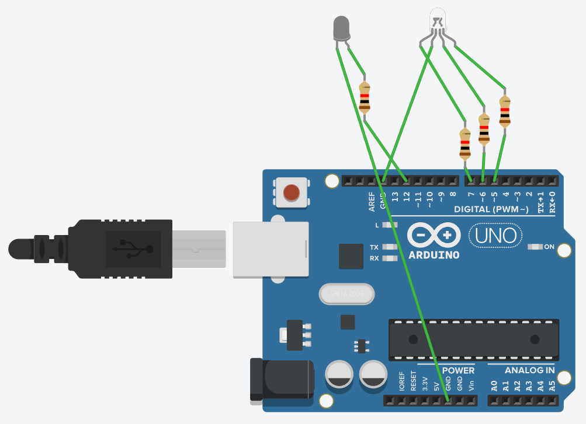
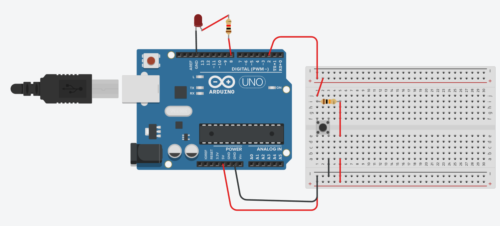
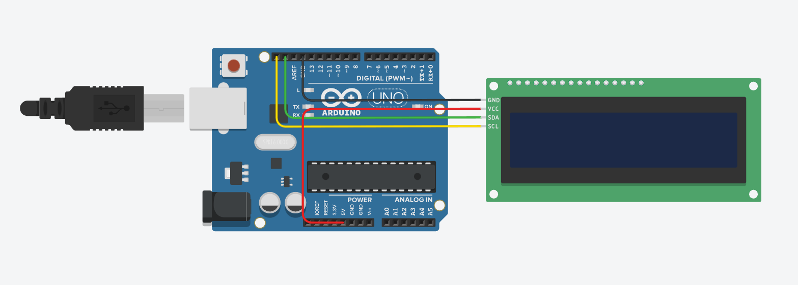
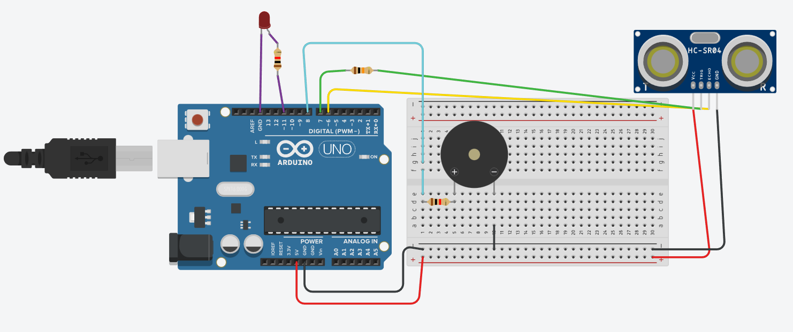

<h1>Sistemas Embarcados 💻</h1>

Repositório criado para alocar os projetos feitos na discipla de Sistemas Embarcados do curso de 
Desenvolvimento de Sistemas do Novotec de São Paulo.

Nessa disciplina foi abordados os conceitos básicos da linguagem <strong>C++</strong> aplicados ao Arduíno UNO.

<h2>Para por em prática os códigos desse repositório 🦾</h2>

Para por em práticas os projeto você pode: 

<ul>
    <li>
Baixar o <a href="https://www.arduino.cc/en/software">Arduino IDE</a> se tiver um Arduino UNO físico
</li>
    
<strong>OU</strong>

    <li>
Montar o projeto no emulador de Arduíno <a href="https://www.tinkercad.com/">Tinkercad</a>
</li>
</ul>

<h2>Projetos 🏗️</h2>

<h3>LED Vermelho + RGB</h3>

<h3>LED acionado por botões</h3>

<h3>Display LCD</h3>

<h3>Sensor de distância</h3>
